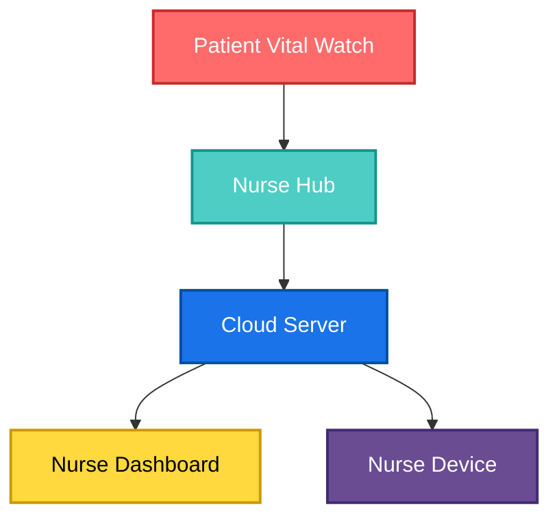

# Vital Watch - Repository


Hardware details for the Vital environment - Block diagrams , architecture , flow ,  Schematics , Layouts , 3D files , testing results (proofs of the concepts)


--------Team : ELECTRO-SAPIENS----------

Kalidindi Akash Varma         -     TEAM LEAD

Madabattula Surya Teja        -     SOFTWARE DESIGNER

Thirakala Pranav Sai          -     HARDWARE DESIGNER

Kaknnajyosula Harsha Vardhan  -     TESTING ENGINEER

Contact: tejasurya67049@gmail.com

# Vital Watch — VibeAithon Project  

[](LICENSE)

## 📖 Overview  

**Vital Watch** is a medical-oriented smart wearable developed during **VibeAithon**. Unlike regular smartwatches, this device is focused on **patient health monitoring in hospitals or elder care facilities**.  

The watch continuously monitors critical health parameters like:  
- 🫁 Oxygen (SpO₂) levels  
- 🩸 Blood pressure  
- ⚡ ECG signals  
- 🧍 Fall detection  
- ❤️ Heart rate  

Using **ESP-NOW protocol**, Vital Watch enables **low-power, Wi-Fi-independent communication** between patients’ watches (slaves) and caretaker/nurse watches (masters). It also supports **hybrid communication** — automatically switching to Wi-Fi for long-range alerts when out of ESP-NOW range.  

---

## 🚑 Real-Life Use Case  

Imagine a hospital with **10 patients assigned to one nurse**. Monitoring all patients constantly is almost impossible, and delays can be fatal in cases of:  
- Sudden **low BP**  
- **Low oxygen levels**  
- Unexpected **falls or faints**  

With **Vital Watch**:  
- Each patient is given a **slave watch**.  
- The nurse is given a **master watch**.  
- If a patient’s vitals drop or they faint, the nurse’s watch instantly receives an **alert**.  
- Nurse can take immediate action, **reducing risk of sudden deaths**.  

Thanks to **ESP-NOW**, the system does not need Wi-Fi or Bluetooth, ensuring faster, lightweight communication.  
When outside ESP-NOW’s range, it **seamlessly switches to Wi-Fi** for cloud-based alerts, then reverts back to ESP-NOW when in range again.  

---

## ✨ Features  

- **Vital Monitoring**: Continuous tracking of SpO₂, blood pressure, heart rate, ECG.  
- **Fall Detection**: Alerts caretaker in case of sudden patient collapse.  
- **ESP-NOW Communication**: Low-latency, Wi-Fi-free protocol for local alerts.  
- **Wi-Fi Integration**: Cloud-based alerts when outside ESP-NOW range.  
- **Multi-Device Support**: Multiple patient watches (slaves) can be paired with a single nurse watch (master).  
- **Fail-Safe Alerts**: Nurse receives notifications instantly on critical events.  

---

## 🏗️ System Architecture  


---

## 📂 Repository Structure 

```bash
VITAL_WATCH__VIBEAITHON/
│
├── FIRMWARE/                 # All ESP32 firmware code
│   ├── Master/               # Code for Nurse Watch (Master mode)
│   └── Slave/                # Code for Patient Watch (Slave mode)
│
├── HARDWARE/                 # Hardware design files
│   ├── Schematics/           # Circuit diagrams
│   ├── PCB_Layouts/          # PCB board design
│   └── Components/           # List of sensors & parts
│
├── docs/                     # Documentation
│   ├── System_Architecture.md
│   ├── Flowcharts/
│   └── Diagrams/
│
├── LICENSE                   # License file (MIT)
└── README.md                 # Project documentation (this file)
